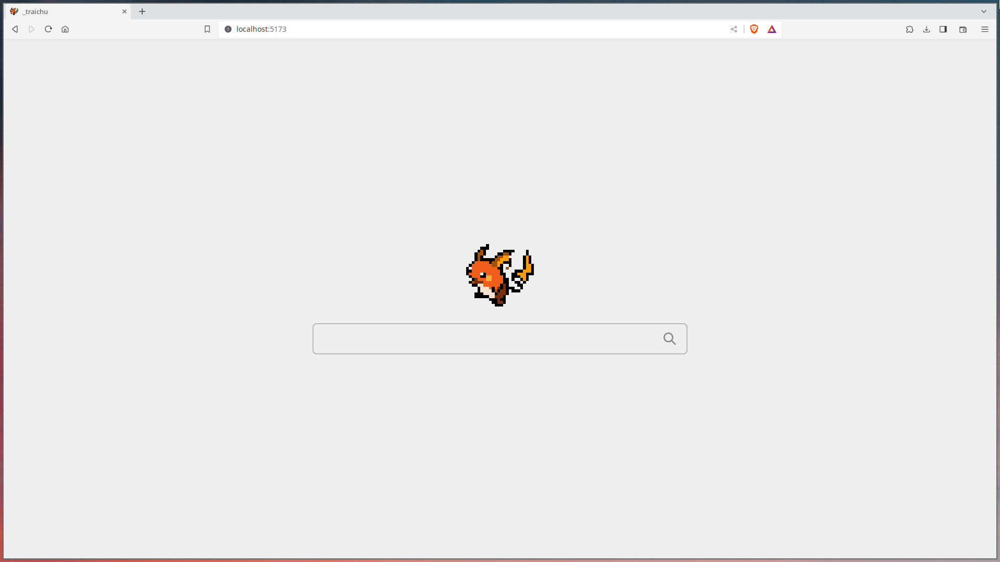
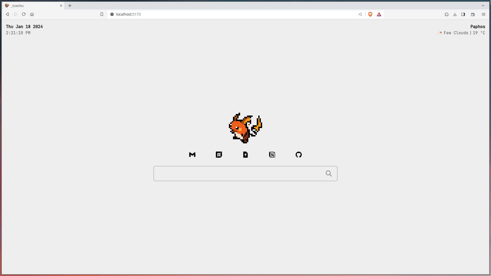
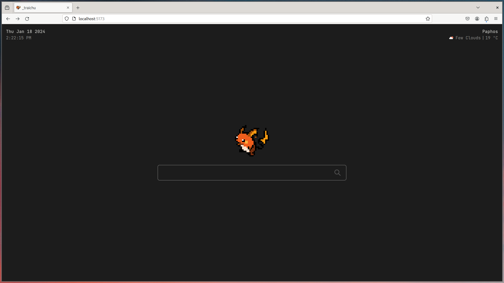

# Traichu
- Uses duck duck go search engine
- `98` Performance on [PageSpeed Insights](https://pagespeed.web.dev/analysis/https-traichu-netlify-app/8nyntpnjmj?form_factor=desktop)
- Made on [vue](https://vuejs.org)
- Has keybindings

# Screenshots

# Keybindings
| Key | action |
|---|---|
| g | redericts to [Github](https://github.com) |
| G | redericts to [Gitlab](https://gitlab.com) |
| d | closes dock with icons |
| `<C-d>` | Minimalist Mode |
| D | redericts to [Discord](https://discord.com/app) |
| m | redericts to [Google Mail](https://mail.google.com/) |
| M | redericts to [Tuta Mail](https://tuta.io/) |
| c | redericts to [Google Calendar](https://calendar.google.com) |
| n | redericts to [Notion](https://notion.so) |
| k | redericts to [Google Keep](https://keep.google.com) |
| i | focus on search input |
| `<Esc>` | unfocus search input |
